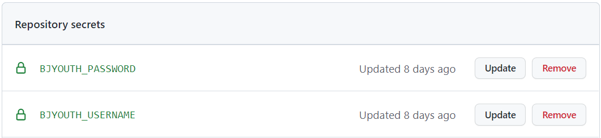

<h1 align="center">
bjyouth-qndxx-action
</h1>

<p align="center">
使用 GitHub Actions 自动完成学习打卡。
</p>

<p align="center">
这个 Action 会在每周的周一/三/五/日在 12:00 AM 尝试学习打卡。
</p>

## 使用方法

点击右上角的 Fork 按钮创建自己的 Repository。

然后，点进仓库中的 Settings 页面，选择 Secrets 下的 Actions 项，点击右上角 New repository secret 按钮添加信息：


需要设置以下信息：

- `BJYOUTH_USERNAME`：登录青春北京的用户名
- `BJYOUTH_PASSWORD`：登录青春北京的密码

> 可以在 https://m.bjyouth.net/site/login 测试登录信息。

设置完成后，可以在页面中看到已设置的 Repository secrets：



最后，点进仓库的 Actions 页面，启用 GitHub Actions 功能。然后，在 Actions 页面下，点选描述为 Automatically check bjyouth qndxx 的工作流，点击 Enable workflow 按钮启用。


如果你想手动运行，可以点进仓库的 Actions 页面，在 Automatically check bjyouth qndxx 工作流中，点击右上角的 Run workflow 运行。


**注意**：从 2022/11/04 开始，由于域名解析问题，需要配置一个回国代理服务器，才能正常使用，详情参考 Issue#1。使用代理服务器需要配置以下 Secret：

- `HTTPS_PROXY`：代理服务器地址，格式为 `http://<host>:<port>`

## 检查结果

无需任何设置。如果运行失败，GitHub 会向你的邮箱发送一封邮件。

### ServerChan

[Server 酱](https://sct.ftqq.com/) 可以把填报结果推送到微信服务号或者企业微信内。你可以设置如下 Secret 发送结果：

- `SERVERCHAN_KEY`：你的 SendKey

## 高级设置

你可以在 `.github/workflows/main.yml` 中来设置每天运行的时间：

```
on:
  schedule:
    - cron: '0 0 * * *'
```

格式是标准的 cron 格式，五个数字分别代表分钟、小时、日期、月份和星期。例如，`0 1 * * *` 表示在每天格林尼治时间的 1:00 AM，也就是在北京时间的 9:00 AM 自动运行。
